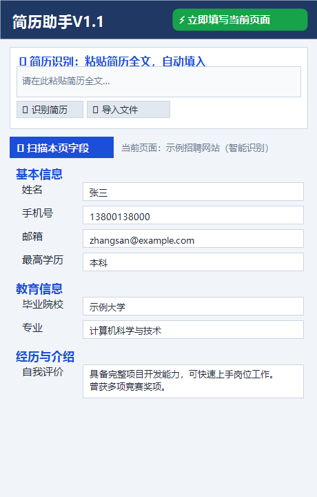
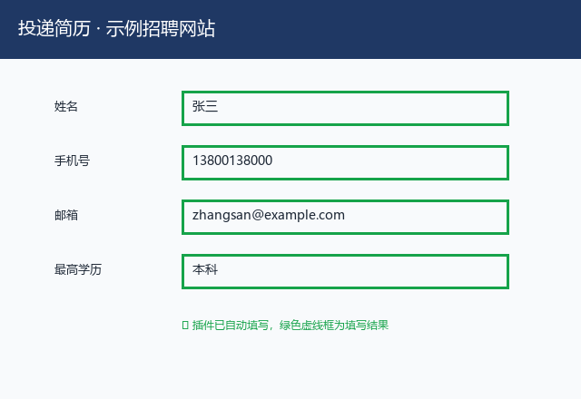
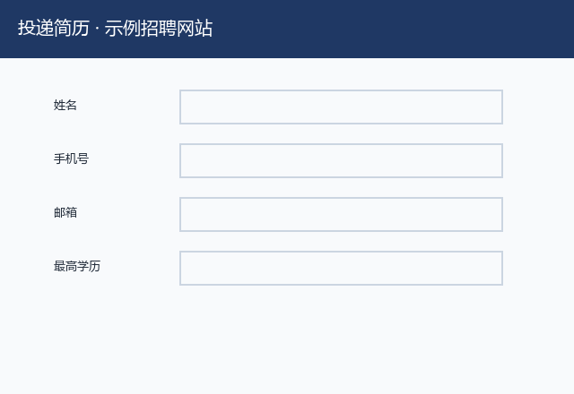

# 简历助手 / Resume Autofill Assistant

一个 Chrome / Edge 浏览器扩展（Manifest V3）：一键自动填写 BOSS直聘、智联招聘、前程无忧、拉勾、猎聘、实习僧、快手校招等招聘网站上的在线简历表单。

A Manifest V3 browser extension for Chrome / Edge that auto-fills online resume / application forms on Chinese job boards (BOSS直聘, 智联招聘, 前程无忧, 拉勾, 猎聘, 实习僧, 快手校招, and more).

## 截图 / Screenshots

## 演示动图 / Demo

## 功能特性 / Features

- **一键填写**：打开招聘网站简历页，点击「立即填写当前页面」，几十个字段自动填好，绿色高亮提示结果。
- **简历识别**：粘贴简历全文，或导入 Word / PDF / txt 文件，自动识别姓名、电话、学历、经历等字段并填入。
- **自定义字段**：遇到网站特有的新字段，可自行添加“字段名 + 内容”，填写时自动匹配。
- **智能识别兜底**：即使站点未单独适配，也会根据输入框的 placeholder、标签、name 等自动识别。
- **数据本地存储**：所有简历数据仅保存在本机浏览器（chrome.storage.local），不会上传到任何服务器。

- **One-click fill** — open a job site's resume page and click "Fill Current Page"; dozens of fields are auto-filled with green highlights.
- **Resume recognition** — paste your full resume, or import Word / PDF / txt files; name, phone, education, experience and more are auto-detected and filled.
- **Custom fields** — add site-specific fields ("field name + content") yourself; they match and fill automatically.
- **Smart fallback matching** — even without a site adapter, inputs are matched by placeholder, label, or `name` attributes.
- **Local-only storage** — all resume data stays in your browser (`chrome.storage.local`); nothing is uploaded.

## 安装 / Installation

1. 下载或克隆本仓库。
2. 打开浏览器扩展管理页：Edge → `edge://extensions/`；Chrome → `chrome://extensions/`。
3. 打开右上角「开发人员模式 / Developer mode」。
4. 点击「加载已解压的扩展程序 / Load unpacked」，选择本仓库文件夹。
5. 工具栏出现 📋 图标即可使用。

## English Installation Guide

1. Download or clone this repository.
2. Open the extensions page in your browser:
   - Edge: `edge://extensions/`
   - Chrome: `chrome://extensions/`
3. Enable **Developer mode** (toggle in the top-right corner).
4. Click **Load unpacked** and select the repository folder.
5. The 📋 icon will appear in the toolbar; you can pin it if you like.

### How to Use

1. Click the 📋 icon to open the popup.
2. Enter your resume: paste your resume text, or import a Word / PDF / txt file to auto-fill, or fill in the fields manually — changes are saved automatically.
3. Open a job site's resume / application page, then click **⚡ Fill Current Page** (or right-click the page and choose "Fill form with resume data").
4. Filled fields are highlighted in green.

### Notes

- All data is stored locally in your browser (`chrome.storage.local`). Nothing is uploaded.
- Some sites use custom dropdowns, date pickers, or file uploads that require manual input.

## 使用 / Usage

1. 点击 📋 图标，录入简历：粘贴简历全文 / 导入 Word、PDF、txt 自动识别，或手动填写（改动自动保存）。
2. 打开招聘网站的简历编辑页或投递页。
3. 点击「⚡ 立即填写当前页面」，或使用页面右键菜单「用简历数据填写本页表单」。

1. Click the 📋 icon and enter your resume: paste the full text, import a Word / PDF / txt file to auto-recognize, or fill in manually (changes are saved automatically).
2. Open the resume editing or application page on a job site.
3. Click **⚡ Fill Current Page**, or use the page's right-click menu "Fill form with resume data".

## 自定义字段 / Custom Fields

在弹窗最下方「自定义字段」分组中添加“字段名 + 内容”，之后在任意网站遇到该字段名时会自动匹配填写。

Add "field name + content" under the Custom Fields group at the bottom of the popup; fields matching those names will be auto-filled on any site.

## 隐私说明 / Privacy

插件不收集、不上传任何数据。所有简历信息均保存在本机浏览器的 `chrome.storage.local` 中。

The extension collects and uploads nothing. All resume information is stored locally in your browser's `chrome.storage.local`.

## 为网站做适配 / Add a New Site

在 `content/sites.js` 的 `SITE_ADAPTERS` 中添加站点域名与字段选择器即可。也欢迎通过 Issue 反馈网站改版导致的适配问题。

Add the site domain and field selectors to `SITE_ADAPTERS` in `content/sites.js`. Issues are welcome for reporting adapter problems caused by site updates.

## 许可证 / License

本项目使用 MIT 许可证开源。This project is open-sourced under the [MIT License](LICENSE).
